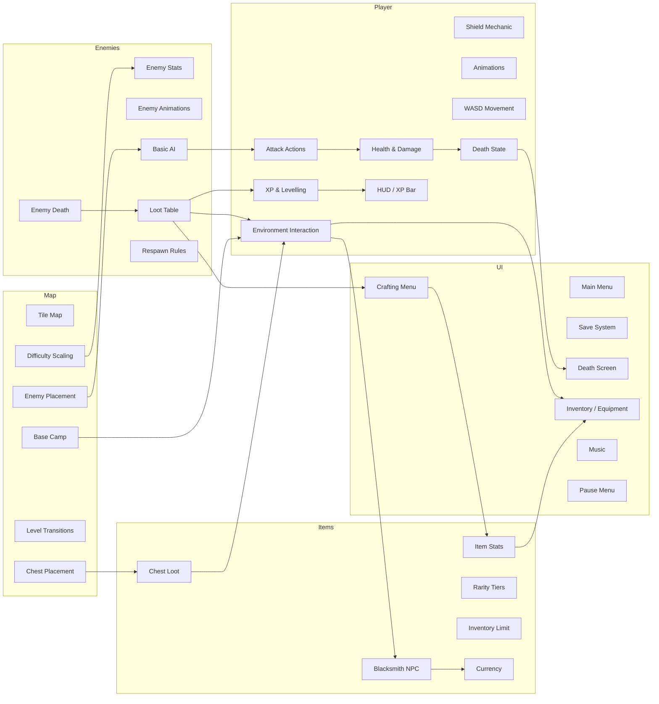

```mermaid
graph LR

subgraph Player
PL01["XP & Levelling"]
PL02["Health & Damage"]
PL03["Shield Mechanic"]
PL04["Animations"]
PL05["WASD Movement"]
PL06["Attack Actions"]
PL07["Environment Interaction"]
PL08["Death State"]
PL09["HUD / XP Bar"]
end

subgraph Enemies
EN01["Enemy Stats"]
EN02["Enemy Animations"]
EN03["Basic AI"]
EN04["Loot Table"]
EN05["Enemy Death"]
EN06["Respawn Rules"]
end

subgraph Map
MP01["Tile Map"]
MP02["Enemy Placement"]
MP03["Base Camp"]
MP04["Chest Placement"]
MP05["Level Transitions"]
MP06["Difficulty Scaling"]
end

subgraph UI
UI01["Main Menu"]
UI02["Save System"]
UI03["Death Screen"]
UI04["Crafting Menu"]
UI05["Inventory / Equipment"]
UI06["Music"]
UI07["Pause Menu"]
end

subgraph Items
IT01["Item Stats"]
IT02["Rarity Tiers"]
IT03["Chest Loot"]
IT04["Inventory Limit"]
IT05["Blacksmith NPC"]
IT06["Currency"]
end

%% Dependencies extracted from the file

PL02 --> PL08
PL08 --> UI03
PL01 --> PL09

EN05 --> EN04
EN04 --> PL01
EN04 --> PL07
EN04 --> UI04

PL07 --> UI05
PL07 --> IT05

MP04 --> IT03
IT03 --> PL07

UI04 --> IT01
IT01 --> UI05

IT05 --> IT06

MP02 --> EN03
EN03 --> PL06
PL06 --> PL02

MP03 --> PL07
MP06 --> EN01
```
