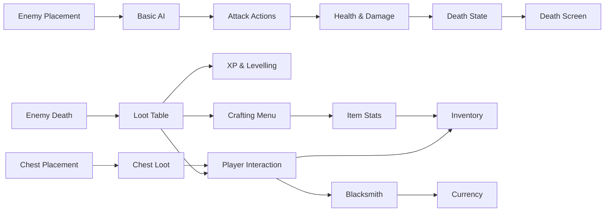

# 🍄⚔️ Mushroom Slasher

> Slash, loot, survive, repeat.


---

## 🍄 About The Game

**Mushroom Slasher** is a top-down action RPG dungeon crawler where players fight through dangerous mushroom-infested dungeons, collect loot, upgrade equipment, and grow stronger with every run.

Explore increasingly difficult levels, defeat hostile creatures, gather resources, craft powerful gear, and uncover the secrets hidden beneath the forest.

---

## 🎮 Planned Features

### ⚔️ Combat
- Melee combat
- Ranged weapons
- Magic attacks
- Enemy encounters
- Damage & health systems

### 📈 Progression
- Experience points
- Leveling system
- Stat upgrades
- Equipment progression

### 🎒 Loot & Inventory
- Random loot drops
- Equipment rarity tiers
- Inventory management
- Crafting materials

### 👾 Enemies
- Basic AI
- Multiple enemy types
- Difficulty scaling
- Loot tables

### 🗺️ World
- Dungeon levels
- Base camp hub
- Chest rewards
- Level transitions

### 🖥️ Interface
- Main menu
- Inventory screen
- Crafting menu
- Pause menu
- Save system

---

## 📊 Core Dependency Graph



---

## 🚧 Development Progress

### Core Systems
- [ ] Player Movement
- [ ] Combat System
- [ ] Enemy AI
- [ ] Collision System

### Progression
- [ ] XP & Levels
- [ ] Loot Drops
- [ ] Equipment System

### World
- [ ] Dungeon Maps
- [ ] Base Camp
- [ ] Level Transitions

### UI
- [ ] Main Menu
- [ ] Inventory
- [ ] Crafting
- [ ] Save System

---

## 📁 Project Structure

```text
MushroomSlasher/
│
├── src/
│   ├── player/
│   ├── enemies/
│   ├── items/
│   ├── map/
│   ├── ui/
│   └── core/
│
├── assets/
│   ├── sprites/
│   ├── audio/
│   ├── fonts/
│   └── maps/
│
├── docs/
│
└── README.md
```

---

## 📸 Screenshots

Screenshots and gameplay footage will be added as development progresses.

> 🚧 Work in Progress 🚧

---

## 🎯 Current Goal

Develop a playable prototype featuring:

- Character movement
- Basic combat
- Enemy AI
- Loot system
- Inventory management
- Dungeon exploration

---

## 🌱 Future Plans

- More enemy varieties
- Boss encounters
- Expanded crafting
- Procedural dungeons
- Skill trees
- Multiplayer support (TBD)

---

## 📝 License

This project is currently under development.

License details will be added before the first public release.

---

### 🍄 "The deeper you go, the deadlier the mushrooms become."